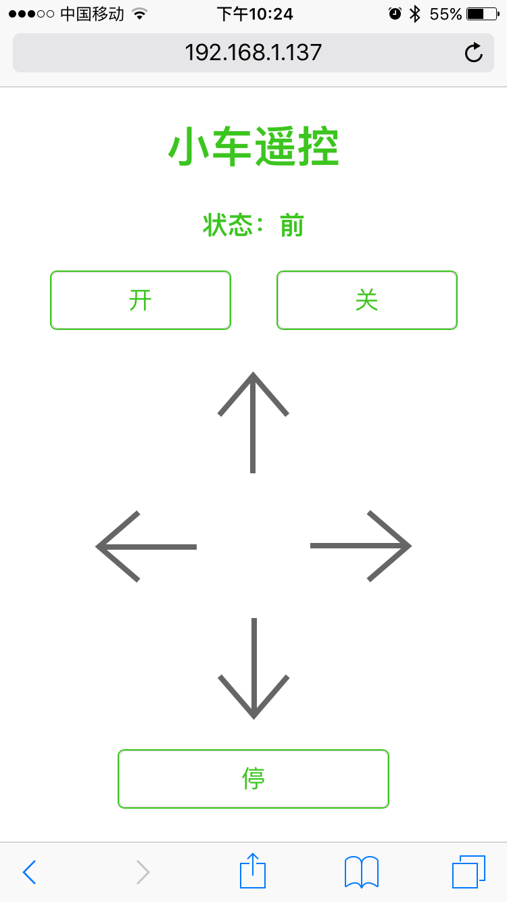

# NanoPi M1 HTTP 小车

将M1的11，13，15，16号引脚分别与L289N的In1，In2，In3，In4连接。

然后执行如下命令：

	$ sudo go run car.go
	-------------------------------------------
	Car is ready on http://192.168.1.137:8000
	-------------------------------------------
	
在浏览器中打开终端输出的地址即可控制小车运动。

